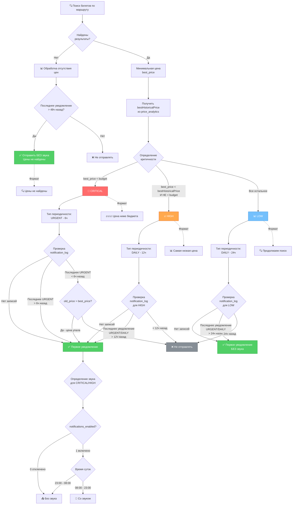

***

# 📋 Полное описание системы уведомлений

## Концепция

Система уведомлений построена на трёх независимых свойствах:

1. **Критичность** — определяет важность находки
2. **Периодичность** — контролирует частоту отправки
3. **Внешний вид** — формат сообщения для пользователя

***

## 🎯 Шаг 1: Проверка наличия результатов

После выполнения поиска билетов по маршруту система проверяет наличие результатов.

### Если результаты НЕ найдены:

- Проверяется последнее уведомление в `notification_log` для данного маршрута
- **Если прошло > 48 часов** → отправляется уведомление "Цены не найдены, продолжаем поиск" **БЕЗ звука**
- **Если прошло < 48 часов** → уведомление НЕ отправляется

### Если результаты найдены:

Переход к определению критичности.

***

## 🚦 Шаг 2: Определение критичности

Система выбирает минимальную цену среди найденных билетов (`best_price`) и сравнивает с:
- **budget** — бюджет пользователя для данного маршрута
- **bestHistoricalPrice** — лучшая цена за всю историю поиска из таблицы `price_analytics`

### Правила определения критичности:

```javascript
if (best_price < budget) {
  priority = 'CRITICAL';
}
else if (best_price < bestHistoricalPrice) {
  priority = 'HIGH';
}
else {
  priority = 'LOW';
}
```

| Условие | Критичность |
|---------|-------------|
| `best_price < budget` | 🚨 **CRITICAL** |
| `best_price < bestHistoricalPrice` И НЕ `< budget` | 🔥 **HIGH** |
| Все остальные случаи | 📊 **LOW** |

***

## ⏰ Шаг 3: Определение типа периодичности

Тип периодичности зависит от критичности:

| Критичность | Тип периодичности | Частота |
|-------------|-------------------|---------|
| CRITICAL | **URGENT** | **Раз в 6 часов** |
| HIGH | **DAILY** | **Раз в 12 часов** |
| LOW | **DAILY** | **Раз в 24 часа** |

***

## ✅ Шаг 4: Проверка возможности отправки

### Для типа URGENT (только CRITICAL):

Проверяется `notification_log` для поиска последнего уведомления с типом `URGENT` по данному маршруту:

1. **Нет записей в notification_log** → ✅ **Отправляем** (первое уведомление для маршрута)

2. **Последнее URGENT уведомление было > 6 часов назад** → ✅ **Отправляем**

3. **Последнее URGENT уведомление было < 6 часов назад:**
    - Получаем `old_price` из `notification_log.price`
    - Проверяем: `old_price > best_price`? (цена упала или не изменилась?)
    - Если **ДА** → ✅ **Отправляем** (цена улучшилась)
    - Если **НЕТ** → ❌ **Не отправляем** (цена выросла)

### Для HIGH (периодичность 12 часов):

Проверяется `notification_log` для поиска последнего уведомления **любого типа** (URGENT или DAILY) по данному маршруту:

1. **Нет записей в notification_log** → ✅ **Отправляем** (первое уведомление для маршрута)

2. **Последнее уведомление было > 12 часов назад** → ✅ **Отправляем**

3. **Последнее уведомление было < 12 часов назад** → ❌ **Не отправляем**

### Для LOW (периодичность 24 часа):

Проверяется `notification_log` для поиска последнего уведомления **любого типа** (URGENT или DAILY) по данному маршруту:

1. **Нет записей в notification_log** → ✅ **Отправляем** (первое уведомление для маршрута)

2. **Последнее уведомление было > 24 часов назад** → ✅ **Отправляем**

3. **Последнее уведомление было < 24 часов назад** → ❌ **Не отправляем**

***

## 🔊 Шаг 5: Определение звука

### Для LOW (всегда):

```javascript
disable_notification = true; // Всегда БЕЗ звука
```

### Для CRITICAL и HIGH:

```javascript
let disable_notification = false;

// Проверка 1: Настройки пользователя
if (user.notifications_enabled === 0) {
  disable_notification = true;
}

// Проверка 2: Ночное время (23:00 - 08:00)
const hour = new Date().getHours();
if (hour >= 23 || hour < 8) {
  disable_notification = true;
}
```

**Итоговая логика:**
- **CRITICAL/HIGH** со звуком → только если `notifications_enabled = 1` **И** время 08:00-23:00
- Во всех остальных случаях → без звука

***

## 🎨 Шаг 6: Формат сообщения

Формат зависит от критичности:

### 🚨 CRITICAL — "Цена ниже бюджета"

**Заголовок:** `🔥🔥🔥 Цена ниже бюджета`

**Формат:** Текущий CRITICAL-формат с:
- Яркий заголовок с тремя огнями
- Крупная цена сразу после маршрута
- Акцент на экономии жирным шрифтом
- Элемент срочности "⚡️ Цена может вырасти в ближайшие часы"
- Inline-кнопка "🎫 КУПИТЬ СЕЙЧАС"

```
🔥🔥🔥 Цена ниже бюджета

<b>Екатеринбург → Стамбул</b>
📅 13.03–20.03 (7 дней)
👥 2 взрослых

💎 <b>14 900 ₽</b> за всех

<b>💰 Экономия 7 400 ₽ (-33%)</b>

🎯 Ваш бюджет: 18 000 ₽ ✅
📊 Обычная цена: 22 300 ₽

✈️ Turkish Airlines • Прямой • 🧳

⚡️ <b>Цена может вырасти в ближайшие часы</b>

[🎫 КУПИТЬ СЕЙЧАС]
```

### 🔥 HIGH — "Самая низкая цена"

**Заголовок:** `📊 Самая низкая цена • ЧЧ:ММ`

**Формат:** Текущий HIGH-формат с:
- Нейтральный заголовок со временем
- Компактная информация о пассажирах
- Сравнение с бюджетом и средней ценой
- Успокаивающее "Продолжаю искать"
- Inline-кнопка "🎫 Посмотреть билет"

```
📊 Самая низкая цена • 16:52

<b>Москва → Денпасар (Бали)</b>
📅 4.03–1.04 (28 дней)
👥 4+1 • 1 пересадка • 🧳

💰 <b>386 646 ₽</b> за всех

Ваш бюджет: 350 000 ₽ (+10%)
Средняя цена: 437 551 ₽ (-12%)

✈️ Emirates

💡 Продолжаю искать варианты в бюджете

[🎫 Посмотреть билет]
```

### 📊 LOW — "Продолжаем поиск"

**Заголовок:** `🔍 Продолжаем поиск • ЧЧ:ММ`

**Формат:** Текущий LOW-формат с минимумом информации:
- Только цена и бюджет
- Нет призывов к покупке
- Фокус на продолжении поиска

```
🔍 Продолжаем поиск • 16:52

<b>Екатеринбург → Москва</b>
📅 26.02–28.03
👥 4+1

Цена: 80 736 ₽
Ваш бюджет: 40 000 ₽ (превышение в 2 раза)

Продолжаю мониторинг 🔎
```

### ❌ Нет цен

**Заголовок:** `🔍 Цены не найдены • ЧЧ:ММ`

**Формат:**
```
🔍 Цены не найдены • 15:20

<b>Екатеринбург → Мальдивы</b>
❌ Цены не найдены
Ваш бюджет: 120 000 ₽

Сейчас выполнено 45 проверок. Всего проверок 2184

Продолжаю мониторинг 🔍
```

***

## 📊 Сводная таблица

| Критичность | Периодичность | Условие отправки | Звук | Формат |
|-------------|---------------|------------------|------|--------|
| 🚨 CRITICAL | URGENT | Раз в 6ч ИЛИ при падении цены | Да* | 🔥🔥🔥 Цена ниже бюджета |
| 🔥 HIGH | DAILY | **Раз в 12ч** | Да* | 📊 Самая низкая цена |
| 📊 LOW | DAILY | Раз в 24ч | **НЕТ** | 🔍 Продолжаем поиск |
| ❌ Нет цен | — | Раз в 48ч | НЕТ | 🔍 Цены не найдены |

**\* Звук:** Только если `notifications_enabled = 1` **И** время 08:00-23:00

***

## 💾 Структура записи в notification_log

```sql
INSERT INTO notification_log (
  chat_id,
  route_id,
  priority,               -- 'CRITICAL', 'HIGH', 'LOW', 'NO_RESULTS'
  price,                  -- Минимальная цена или NULL если NO_RESULTS
  message_type,           -- 'URGENT', 'DAILY', 'NO_RESULTS'
  sent_at,                -- datetime('now')
  disable_notification    -- 0 или 1
) VALUES (?, ?, ?, ?, ?, datetime('now'), ?);
```

### Примеры записей:

```sql
-- CRITICAL уведомление днём со звуком
(123456, 1, 'CRITICAL', 14900, 'URGENT', '2026-02-08 14:30:00', 0)

-- HIGH уведомление днём со звуком (раз в 12ч)
(123456, 2, 'HIGH', 386646, 'DAILY', '2026-02-08 10:15:00', 0)

-- HIGH уведомление через 12ч
(123456, 2, 'HIGH', 384000, 'DAILY', '2026-02-08 22:30:00', 0)

-- LOW уведомление (всегда без звука)
(123456, 3, 'LOW', 80736, 'DAILY', '2026-02-08 16:52:00', 1)

-- Нет результатов
(123456, 4, 'NO_RESULTS', NULL, 'NO_RESULTS', '2026-02-08 15:20:00', 1)
```

***

## 🔍 Примеры сценариев

### Сценарий 1: CRITICAL с частыми падениями цены

**Данные:**
- Бюджет: 20,000 ₽
- 10:00 → найдено 19,500 ₽ → отправлено (первое)
- 12:00 → найдено 19,400 ₽ → отправлено (цена упала)
- 14:00 → найдено 19,600 ₽ → НЕ отправлено (цена выросла, < 6ч)
- 17:00 → найдено 19,300 ₽ → отправлено (цена упала)

### Сценарий 2: HIGH раз в 12 часов

**Данные:**
- Бюджет: 50,000 ₽
- Исторический минимум: 60,000 ₽
- День 1, 10:00 → найдено 58,000 ₽ → отправлено (первое)
- День 1, 14:00 → найдено 57,500 ₽ → НЕ отправлено (< 12ч)
- День 1, 22:00 → найдено 57,000 ₽ → отправлено (> 12ч)
- День 2, 06:00 → найдено 56,500 ₽ → НЕ отправлено (< 12ч)
- День 2, 10:00 → найдено 56,000 ₽ → отправлено (> 12ч)

### Сценарий 3: LOW без спама

**Данные:**
- Бюджет: 30,000 ₽
- День 1, 10:00 → найдено 45,000 ₽ (LOW) → отправлено БЕЗ звука (первое)
- День 1, 18:00 → найдено 44,500 ₽ (LOW) → НЕ отправлено (< 24ч)
- День 2, 11:00 → найдено 44,000 ₽ (LOW) → отправлено БЕЗ звука (> 24ч)

### Сценарий 4: Переход между уровнями

**Данные:**
- Бюджет: 40,000 ₽
- Исторический минимум: 50,000 ₽
- День 1, 10:00 → найдено 55,000 ₽ (LOW) → отправлено БЕЗ звука
- День 1, 22:00 → найдено 48,000 ₽ (HIGH) → отправлено со звуком (< 24ч, но HIGH другой тип)
- День 2, 08:00 → найдено 39,000 ₽ (CRITICAL) → отправлено со звуком (< 12ч, но CRITICAL другой тип)

***

## 🎯 Ключевые особенности

✅ **CRITICAL** — самый частый (6ч) + отправляется при падении цены  
✅ **HIGH** — отправляется каждые 12 часов (2 раза в день при активном поиске)  
✅ **LOW** — раз в сутки, всегда без звука  
✅ **Нет спама** — строгий контроль периодичности для каждого типа  
✅ **Умный звук** — учитывает настройки пользователя и время суток

Готово! HIGH теперь отправляется раз в 12 часов.